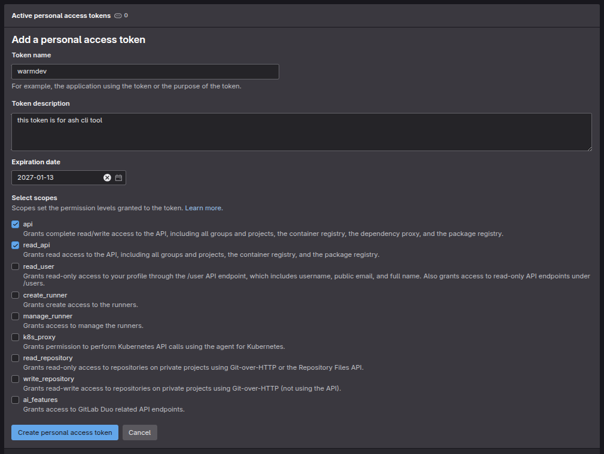

# Hướng dẫn bắt đầu

## Yêu cầu trước

Trước khi sử dụng `ash`, hãy đảm bảo bạn đã có GitLab Personal Access Token (PAT) với quyền `api` và `read api`.

### Cách lấy Personal Access Token

1. Truy cập [ACCESS TOKEN](https://git.rikkei.edu.vn/-/user_settings/personal_access_tokens)
2. Tạo token mới tới tên và mô tả bất kì ( có thể trống ) và ngày hết hạn token là lâu nhất có thể ( tránh phải tạo lại nhiều lần )
   

## 1. Xác thực (Authentication)

Đầu tiên, đăng nhập vào GitLab:

```bash
ash auth login -t <your-token>
```

## 2. Kiểm tra cài đặt

Chạy lệnh doctor để kiểm tra xem mọi thứ đã được thiết lập chính xác chưa:

```bash
ash doctor
```
